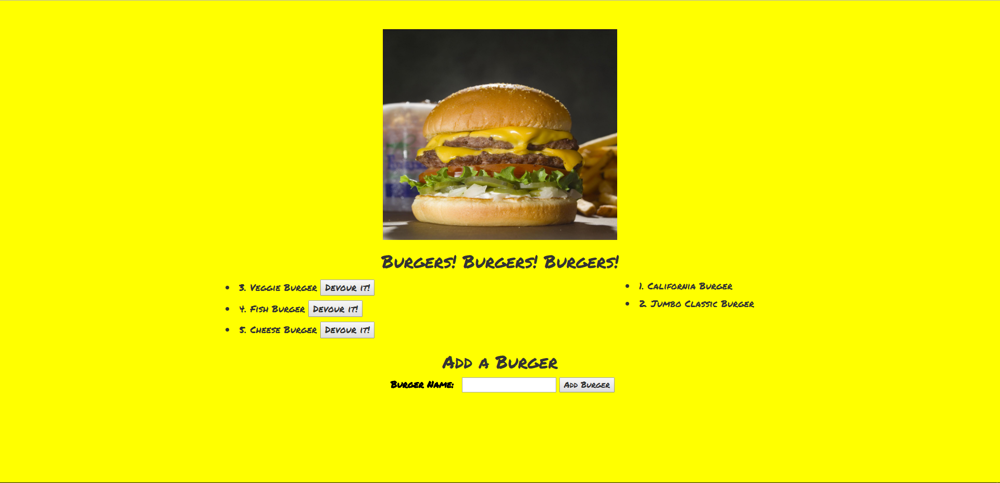

<h1> Burger! Burger! Burger! </h1>

<h2><strong>Overview</strong></h2>

A Node, Express, Handlebars, and MySQL burger app that lets users input the names of burgers they'd like to eat... and then devour them! Please check out the launched app on Heroku here: https://ancient-reef-11912.herokuapp.com/

### Functionality
Using an home-grown ORM, the app has 3 basic CRUD functions...
  1. <strong>READ</strong> all entries from the MySQL database and display them to the DOM using Handlebars.
  2. UPDATE a selected burger by clicking "Devour It", which...
    * hits an `/burger/eat/:id` route in Express to change its "devoured" status in the MySQL database
    * re-routes the webpage back to the index, where the burger is now in the devoured column (via Handlebars)
  3. CREATE a new burger using the "Place Order" form, which...
    * hits a `/burger/create` route in Express to insert a new burger into the MySQL database
    * re-routes the webpage back to the index, where the burger is now ready to be eaten column (via Handlebars)

<h2>Functionality</h2>

Using an home-grown ORM, the app has 3 basic CRUD functions...

<strong>READ</strong> all entries from the MySQL database and display them to the DOM using Handlebars.

 

<strong>UPDATE</strong> a selected burger by clicking "Devour It", which...

 

<ul>
<li>hits an /burger/eat/:id route in Express to change its "devoured" status in the MySQL database</li>
<li>re-routes the webpage back to the index, where the burger is now in the devoured column (via Handlebars)</li>
</ul>
 

<strong>CREATE</strong> a new burger using the "Place Order" form, which...

 
<ul>
<li>hits a /burger/create route in Express to insert a new burger into the MySQL database</li>
<li>re-routes the webpage back to the index, where the burger is now ready to be eaten column (via Handlebars)</li>
</ul>
 
<h2><strong>Screenshot</strong></h2>
 
	
